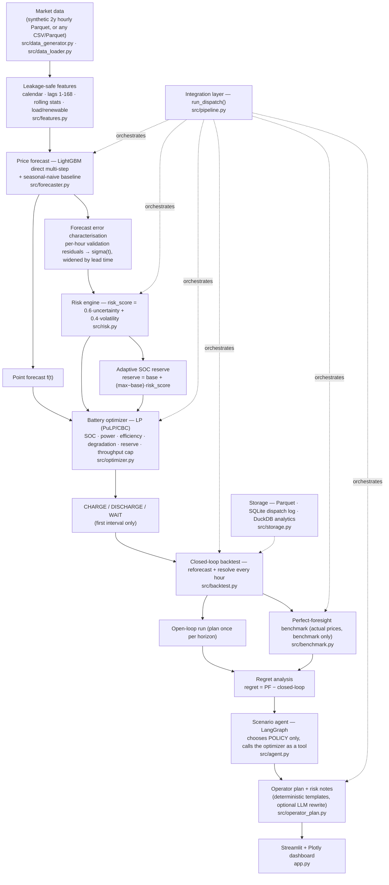

# GridFlex AI — Risk-Aware Intelligent Battery Trading & Dispatch

An AI control room for a grid-connected Battery Energy Storage System (BESS).
It answers one operator question every hour:

> **Should the battery CHARGE, DISCHARGE or WAIT right now — and what should I expect over the next 24–48 hours?**

It answers it the way a trading desk would: forecast the price, measure how wrong
that forecast usually is, convert that uncertainty into a *hard constraint* on the
battery, and only then let a linear programme decide the dispatch — while charging
every MWh moved for the battery life it consumes.

---

## 1. Problem

A battery earns money on the difference between the price it charges at and the
price it discharges at. Two things make this hard:

1. **The future price is unknown.** You commit to charging *before* you know what
   the evening will pay.
2. **Every trade costs battery life.** Round-trip losses and cell degradation mean
   a small spread is a *losing* trade even when it looks positive on screen.

Naive dispatch — "buy the cheapest hour, sell the dearest" — chases small spreads,
burns cycles, and empties the battery right before the hour that actually pays.

## 2. Business logic

```
profit = Σ discharge·price  −  Σ charge·price  −  Σ degradation
```

subject to state of charge, capacity, power, efficiency, and a risk reserve.
The system maximises exactly that expression — it does not maximise "trades".

**Who uses it:** BESS operators and dispatch schedulers, energy trading desks,
C&I and microgrid energy managers, renewable + storage asset owners.

## 3. Why battery arbitrage is difficult

| Reality | Consequence |
|---|---|
| 90% round trip | 1 MWh bought delivers 0.9 MWh. Need **+11%** on price just to break even |
| Degradation ~5/MWh throughput | Charged on **both** legs: another ~10.5/MWh of required spread |
| Forecast error ~8/MWh (1σ) | The "obvious" spread may not exist by the time you get there |
| Price spikes / negative prices | Most of the day's money is in a handful of unforecastable hours |
| Finite horizon | Optimising 24h blindly dumps the battery at hour 24 |

At the default configuration the battery **must see ≈12/MWh of spread before a
cycle is worth doing** (`BatteryConfig.breakeven_spread`, printed on the dashboard).

## 4. Solution — Risk-Aware, Health-Aware Arbitrage

Two ideas, both implemented **inside the optimiser**, not in the narrative:

**(a) Risk enters the prices.** The LP never sees the raw point forecast. It sees
a downside-shifted pair derived from the forecaster's *measured* validation error:

```
p_buy [t] = f[t] + λ·σ[t]      (assume buying is dearer than forecast)
p_sell[t] = f[t] − λ·σ[t]      (assume selling is cheaper than forecast)
```

Because revenue is linear and increasing in `discharge` and cost linear and
increasing in `charge`, the worst case over the box `f ± λσ` is attained exactly
at those corners — so maximising with `(p_buy, p_sell)` *is* maximising worst-case
profit over that uncertainty set. Higher λ ⇒ wider required spread ⇒ fewer, better
trades.

**(b) Risk enters the feasible set.** A risk score computed from forecast
uncertainty + realised volatility is mapped to an **adaptive SOC reserve**, which
becomes the lower bound on stored energy in the LP. Under high uncertainty the
battery is *physically not allowed* to empty itself, so it keeps insurance energy
for an unforecast spike.

**(c) Health enters the objective.** Degradation is charged per MWh of grid-side
throughput on both legs, so thin spreads are rejected by arithmetic, not by a rule.

---

## 5. Architecture



Every arrow above is a real function call — `python demo.py` exercises the whole
chain in one process.

---

## 6. Data

Default is a **deterministic synthetic 2-year hourly dataset** (seed 42) so the
project runs with no registration, API key or download. Schema:

| column | meaning |
|---|---|
| `ts` | hourly timestamp |
| `price_per_mwh` | market clearing price (**negatives preserved**) |
| `load_mw` | system demand |
| `renewable_mw` | wind + solar generation |

The generator (teammate module, reused unchanged) produces diurnal + weekly +
seasonal shape, fuel-cost drift, GARCH-style volatility clustering, scarcity
spikes, and genuine negative-price events driven by renewable surplus.

Realised on the shipped dataset: **17,532 rows, 2023-01-01 → 2024-12-31, mean
43.8/MWh, min −120.0, max 588.7, 730 negative hours (4.2%)**.

Any real dataset works too: `src/data_loader.py` maps common ISO column aliases
(`lmp`, `rrp`, `da_price`, `demand`, `vre`, …), resamples to an hourly grid, fills
gaps causally and **never clips negative prices**.

## 7. Forecasting

* **LightGBM** (`objective="l1"`, robust to spikes), sklearn `HistGradientBoosting`
  as an automatic fallback.
* **Direct multi-step**: every price-derived feature is shifted by the horizon, so
  a single model predicts each hour of the horizon from information available at
  decision time.
* **Chronological 70/15/15 split**, never shuffled.
* **Baseline**: seasonal naive (same hour yesterday) evaluated on the identical
  window.

Measured on the shipped dataset (24h horizon, held-out final 15%):

| model | MAE | RMSE |
|---|---|---|
| LightGBM | **7.79** | 18.36 |
| Seasonal naive (t−24h) | 17.49 | — |
| Rolling closed-loop (t+1, 168h) | 8.45 | 18.00 |
| …**dispatch-weighted** MAE | **5.62** | — |

### Forecast uncertainty (not fabricated)

σ is measured, never assumed: per-hour mean absolute validation residual ×1.2533
(MAE→σ for a normal), widened with lead time by `√(1 + k/H)`. That vector is what
the risk engine and the robust price shift consume. No parametric confidence
interval is invented anywhere.

### Forecast error is not equally expensive

`src/benchmark.py::error_impact` buckets executed hours by absolute forecast error
and reports realised profit per bucket — the evidence that error *in traded hours*
is what costs money. The dashboard shows this table; the backtest reports plain MAE
next to **dispatch-weighted MAE** (5.62 vs 8.45 — the controller is more accurate
exactly where it acts).

## 8. Battery model

```
SOC[t] = SOC[t−1] + charge[t]·η_c − discharge[t]/η_d          η_c = η_d = √RTE
soc_min·C ≤ SOC[t] ≤ soc_max·C          SOC[t] ≤ C
0 ≤ charge[t] ≤ P                       0 ≤ discharge[t] ≤ P
```

Defaults (all configurable in `src/config.py` and in the dashboard sidebar):
capacity 100 MWh, power 25 MW, RTE 90%, SOC band 10–90%, degradation 5/MWh,
initial SOC 50%. Hourly intervals ⇒ 1 MW ≡ 1 MWh per interval.

## 9. Degradation

**Throughput-based marginal cost**, charged on both legs:

```
throughput[t]      = charge[t] + discharge[t]
degradation_cost[t]= throughput[t] · cycle_cost_per_mwh
```

It sits directly in the objective, so it changes dispatch rather than just
reporting. It is simple, linear (keeps the problem an LP), computationally free,
and expresses the one thing that matters economically: *moving energy consumes
asset life*. See Q1 below for the comparison with per-cycle and DoD penalties.

## 10. Optimisation

`src/optimizer.py`, PuLP + bundled CBC:

```
max  Σ_t [ p_sell[t]·d[t] − p_buy[t]·c[t] − cc·(c[t]+d[t]) ]  +  tv·e[T−1]
s.t. e[t] = e[t−1] + c[t]·η_c − d[t]/η_d
     floor ≤ e[t] ≤ soc_max·C           floor = adaptive reserve
     0 ≤ c[t] ≤ P,  0 ≤ d[t] ≤ P
     Σ_t (c[t] + d[t]) ≤ throughput cap
     [optional] e[T−1] ≥ final_soc
```

* **No binary variables.** Simultaneous charge+discharge is unprofitable whenever
  `η_c·η_d < 1` or `cc > 0`, so exclusivity is implied. It is *verified* after each
  solve by `check_no_simultaneous()` and asserted in the tests over flat, wide and
  random price vectors — cheaper and faster than paying for a MIP.
* **Terminal value `tv`** prices energy left at the end of the horizon at a
  conservative (40th percentile) level, so a finite horizon does not force an
  end-of-window dump. It never uses a future actual price.
* **WAIT is a real outcome**: with flat prices the LP trades nothing and every hour
  is labelled WAIT (`test_flat_prices_produce_no_trading`).

## 11. Adaptive reserve (the risk constraint)

```python
u = mean(σ) / price_scale                      # normalised forecast uncertainty
v = std(recent prices) / price_scale           # normalised realised volatility
risk_score   = clip(0.6·û + 0.4·v̂, 0, 1) · f(risk_aversion)
reserve_frac = base + (max − base) · risk_score        # 5% … 25% of capacity
floor        = soc_min·C + reserve_frac·C              # LP lower bound on e[t]
```

Nothing is hardcoded and nothing is random: both inputs are measured. The mapping
lives in `src/risk.py::compute_risk_state` and is fully configurable. If risk rises
*above* the current SOC, the LP relaxes the floor to the current level and refills
rather than reporting infeasible — an operational system must never stall.

## 12. Closed-loop backtest

`src/backtest.py`. For each hour: slice history → forecast → rescore risk →
re-solve the LP → **execute only the next interval** → settle at the **actual**
price → update SOC → step. Reported: revenue, charging cost, degradation, net
profit, throughput, equivalent cycles, CHARGE/DISCHARGE/WAIT counts, avg/min/max
SOC, reserve breaches, MAE/RMSE, dispatch-weighted MAE, solver calls, solve times,
runtime.

## 13. Perfect foresight, regret, open vs closed loop

`src/benchmark.py` solves one LP over the whole window with the **actual** prices —
same physics, same degradation, no risk policy. It is used for scoring only; the
controller has no code path to it.

```
regret     = perfect_foresight_profit − closed_loop_profit
regret_pct = regret / |perfect_foresight_profit| · 100
```

## 14. Example output (recomputed, not pasted)

`python demo.py --hours 168 --horizon 24` on the shipped dataset:

```
DATA      17,532 hourly rows  2023-01-01 -> 2024-12-31 11:00
          mean 43.8  std 33.6  min -120.0  max 588.7  negative hours 730 (4.2%)
AGENT     engine=langgraph  scenario=normal
          risk_aversion=0.625  reserve floor=10%  cycle_cost_multiplier=0.9
DECISION  now=2024-12-30 10:00  price=17.9/MWh
          ACTION=WAIT  SOC=90.0%  risk=ELEVATED (0.62)  adaptive reserve=17% (27.3 MWh)
FORECAST  LightGBM holdout MAE=7.79 RMSE=18.36 (seasonal naive MAE=17.49)
          backtest MAE=8.45  dispatch-weighted MAE=5.62
CLOSED    168h  net=15,603  revenue=29,193  charge cost=9,237  degradation=4,353
          throughput=967 MWh  cycles=6.05  C/D/W=23/33/112  SOC 68/23/90%
BENCHMARK closed=15,603  open=12,796  perfect=35,260  regret=19,657 (55.7%)
          value of closed-loop feedback = 2,807
SOLVER    72 vars / 25 constraints  avg=61 ms  max=154 ms  168 calls
          backtest runtime=16.6s  full pipeline=17.5s
```

Reading it: the controller captures **44%** of a perfect-foresight upper bound that
is itself inflated by unforecastable spikes and −120/MWh events; re-optimising every
hour is worth **+2,807 (+22%)** over planning once per day; and 112 of 168 hours are
WAIT — the system refuses to trade when the spread does not clear breakeven.

*Sanity check on the machinery*: feeding the closed loop a perfect forecast
(`tests/conftest.py::OracleForecaster`) recovers **≥90%** of the perfect-foresight
profit, which localises the remaining regret in the forecast, not in the optimiser
or the execution loop (`test_perfect_foresight_is_an_upper_bound`).

## 15. Scenario agent (LangGraph)

```
Scenario Input → Scenario Analysis → Policy Selection → Optimizer Tool
              → Result Analysis → Risk Analysis → Operator Plan
```

Scenarios: **Normal, High Volatility, Low Renewable, High Renewable, Price Spike,
Conservative**. Each changes real policy parameters (risk aversion, reserve floor,
horizon, degradation sensitivity, forecast stress, volatility assumption) and the
optimiser is re-run — selecting a scenario recomputes the dispatch, it does not
re-label it. The agent also adapts to measured conditions (e.g. "realised
volatility is high → raise risk aversion 25% and require ≥10% reserve") and every
step is exposed as a trace in the dashboard.

`python demo.py --all-scenarios` on the shipped dataset (48h window, 24h horizon) —
the scenario genuinely moves the reserve, the cycling and the money:

| scenario | λ | risk level | reserve (% cap) | equiv. cycles | net profit |
|---|---|---|---|---|---|
| Normal | 0.63 | ELEVATED | 17.3 | 1.36 | 2,129 |
| High Volatility | 1.50 | HIGH | 24.0 | 1.12 | 1,565 |
| Low Renewable | 0.88 | ELEVATED | 19.2 | 1.29 | 2,057 |
| High Renewable | 0.25 | MODERATE | 14.5 | 1.42 | 2,412 |
| Price Spike | 1.00 | HIGH | 20.2 | 1.27 | 2,029 |
| Conservative | 2.50 | HIGH | 25.0 | 0.26 | 51 |

Conservative mode almost stops trading — which is the point: it is capital
preservation, and the cost of that choice is visible rather than hidden.

**The agent is decision support, never the controller.** See Q5.

## 16. Operator plan

Generated from computed values only: market outlook, forecast summary, battery
status, recommended action, expected economics, SOC trajectory, risk level,
adaptive reserve, degradation note, scenario used, warnings. With
`ANTHROPIC_API_KEY` set, Claude may *rewrite* that text for readability (numbers
supplied, never requested); without a key the deterministic template is used and
the system is otherwise identical.

## 17. Dashboard

`app.py` — one page: current status (action / SOC / price / risk / reserve /
breakeven), price forecast with a residual-derived band, dispatch + SOC + reserve
line, the 24/48h plan table, closed-loop economics, benchmark and regret, risk
engine with the reason the reserve moved, the operator plan, the agent trace, and a
live **agent-boundary demo** where you can try to make the agent order a 25 MW
charge and watch it get rejected.

---

## 18. Setup

```bash
python -m venv .venv
.venv\Scripts\activate            # Windows;  source .venv/bin/activate on Unix
pip install -r requirements.txt
cp .env.example .env               # optional, only for the LLM narrative
```

Python 3.10+ (developed on 3.13). CPU only. No API key required.

## 19. How to run

```bash
streamlit run app.py                                  # dashboard
python demo.py                                        # headless, 72h closed loop
python demo.py --hours 168 --horizon 48               # longer run / 48h horizon
python demo.py --scenario price_spike --risk-level 0.8
python demo.py --all-scenarios                        # what-if across all six
python -m src.pipeline                                # one-line smoke test
python -m src.data_generator                          # regenerate the Parquet
```

The dataset regenerates itself if `data/market_prices.parquet` is missing, and the
forecaster trains and caches itself to `models/` on first use (~10 s).

## 20. Tests

```bash
python -m pytest tests -q               # 85 tests, ~19 s
python -m pytest tests -q -m "not slow" # skip the two end-to-end agent tests
```

Coverage: data schema/grid/negatives/determinism; feature leakage (corrupting the
future must not move any feature, and must not move the forecast); chronological
splits; SOC/power/capacity/efficiency; degradation in the objective; reserve as a
binding constraint; risk monotonicity; WAIT with no forced trading; one-interval
execution with actual prices; SOC accounting; regret arithmetic; perfect foresight
as an upper bound; and the agent boundary (every locked key, strict mode, and an
end-to-end attempt to force a dispatch that provably changes nothing).

---

## 21. Questionnaire

### Q1 — How is degradation represented in the objective?

As a **linear marginal cost on grid-side throughput**, charged on both legs:
`cc·(c[t] + d[t])`, inside the maximised objective (`src/optimizer.py`). With
`cc = 5/MWh` and 90% RTE the battery must see
`p_sell ≥ (p_buy + cc)/RTE + cc` ⇒ ≈12/MWh of spread at a 40/MWh buy price before a
cycle is worth doing.

| representation | pros | why not here |
|---|---|---|
| **Throughput (chosen)** | linear → stays an LP; every MWh priced; directly changes dispatch | ignores C-rate/temperature/SoC-dependence |
| Per-cycle penalty | matches warranty language | needs cycle counting (Rainflow) → binaries/non-convexity; a 1% cycle and a 100% cycle cost the same |
| Depth-of-discharge penalty | captures the real convexity of deep cycling | non-linear in SOC → MIQP/piecewise; heavy for a 24–48h rolling solve |

`test_degradation_cost_is_in_the_objective_and_suppresses_cycling` proves higher
`cc` reduces throughput on an otherwise identical problem.

### Q2 — Optimizer solve time on CPU, and what was changed?

24h horizon: **72 variables / 25 constraints, ~61 ms average, 154 ms worst case**
(CBC, single CPU core, 168 consecutive solves). A full 168-hour closed-loop
backtest — 168 forecasts + 168 LP solves + risk scoring — runs in **16.6 s**; the
whole pipeline including the benchmark in **17.5 s**. 48h horizon roughly doubles
the model and stays well inside 200 ms.

What was done to keep it there (no correctness was traded away):
1. **No binaries** — exclusivity is implied by efficiency and degradation, then
   verified post-solve rather than enforced with a MIP.
2. **Compact formulation** — 3 variables and 1 equality per interval, one global
   throughput constraint; no auxiliary cycle-counting variables.
3. **Bounded history in the feature builder** — each backtest step rebuilds
   features on a 720-hour slice instead of the full 2-year frame.
4. **One trained model per horizon, cached** to `models/` and in-process.
5. Rolling-horizon rather than whole-year optimisation: the LP size is constant.

### Q3 — How was the open-loop vs closed-loop gap measured?

Identical code, one parameter: `replan_every = 1` (closed loop, re-forecast and
re-solve every hour, execute only the next interval) versus `replan_every = H`
(open loop, plan once per horizon and follow it, clipped to physical limits). Same
window, same initial SOC, same battery, same risk policy, same realised prices.

Result over 168h: closed **15,603** vs open **12,796** → re-optimising is worth
**+2,807 (+22%)**, i.e. 8% of the perfect-foresight prize.

*Why the gap exists.* An hour-ahead forecast error of Δ shifts the apparent spread.
In the open loop the error is never corrected: the plan keeps discharging into an
hour that turned out cheap, or sits idle through an hour that turned out rich. In
the closed loop the next re-solve sees the realised price in its lag features and
re-plans around it. That is also why we report **dispatch-weighted MAE (5.62)**
alongside plain MAE (8.45), and why `error_impact()` buckets profit by error size:
a 10/MWh error in a flat, untraded hour costs nothing; the same error next to a
discharge decision moves real money.

### Q4 — What risk constraint protects against a bad day?

The **adaptive SOC reserve**, enforced as a lower bound on the LP's energy
variable — not as advice:

```python
# src/risk.py
reserve_frac = base + (max − base) · risk_score        # risk_score from σ and volatility
floor        = soc_min·C + reserve_frac·C
# src/optimizer.py
e[t] = pulp.LpVariable(f"e_{t}", eff_floor, battery.e_max)   # ← floor is the LP bound
```

So `SOC[t] ≥ adaptive_reserve` for every t in the horizon. When uncertainty or
volatility rises, the feasible set shrinks, the battery is not permitted to sell
its last MWh, and insurance energy remains for an unforecast spike. A second
mechanism — the robust price shift `f ± λσ` — widens the spread the LP demands, and
a third — the throughput cap (equivalent full cycles per day) — bounds degradation
exposure on any single day. `test_reserve_reaches_the_optimizer_and_changes_dispatch`
shows a higher measured σ raising the realised SOC floor and lowering throughput.

### Q5 — What may the agent change? What is locked?

| | |
|---|---|
| **Agent may set** (`ALLOWED_POLICY_KEYS`, `src/agent.py`) | `risk_aversion` 0–3, `soc_reserve_frac` 0–0.40, `horizon` 6–48, `cycle_cost_multiplier` 0.5–3, `price_shock` ±0.60, `volatility_multiplier` 0.5–3 |
| **Locked to the optimizer** (`LOCKED_KEYS`) | `charge_mw`, `discharge_mw`, `dispatch`, `action`, `force_action`, `soc`, `soc_mwh`, `reserve_mwh`, `capacity_mwh`, `power_mw`, `soc_min`, `soc_max`, `round_trip_efficiency`, `cycle_cost_per_mwh`, `enforce_reserve`, `max_daily_cycles` |

Enforced in two places:

1. `src/agent.py::sanitize_policy` — the single gate. Locked keys are dropped (or
   raise `PolicyViolation` in strict mode); allowed keys are clipped to their range.
   `node_optimizer_tool` can only pass what survives it.
2. `src/pipeline.py::resolve_policy` — rebuilds `ScenarioConfig`/`RiskConfig` from
   scratch and re-validates; there is no attribute on those objects through which a
   dispatch quantity or battery physical parameter could arrive.

The agent therefore *chooses the question*; the LP *answers* it.
`test_agent_override_of_dispatch_cannot_change_the_plan` asks for a forced 25 MW
charge and 99 MWh SOC and asserts the resulting plan is bit-identical to the honest
run. The dashboard exposes the same gate interactively.

---

## 22. Real-world positioning

Directly applicable in shape to solar+storage and wind+storage arbitrage,
grid-scale BESS trading, C&I storage, microgrids, and EV-charging cost
optimisation (same LP with a demand constraint).

**This is a simulation/prototype.** It does not control a physical battery. A real
deployment would additionally need: live market and telemetry feeds, BMS/SCADA
integration with safety interlocks, market bidding rules and gate closure timing,
ancillary-service co-optimisation, degradation validated against the cell
manufacturer's model, probabilistic/quantile forecasting, production monitoring and
alerting, and regulatory compliance.

## 23. Limitations

* Synthetic market by default; real-market behaviour (outages, congestion, strategic
  bidding) is only approximated.
* Energy arbitrage only — no ancillary services, no capacity payments, no bidding
  curve or market-clearing model; we are a price taker.
* Uncertainty is a per-hour σ from validation residuals, not a full predictive
  distribution; the robust shift is a box, not a distributional guarantee.
* Degradation is throughput-linear: no temperature, C-rate or SoC dependence.
* Perfect-foresight regret is inflated by spike and negative-price hours that no
  causal forecaster could anticipate; read it together with the oracle check in §14.
* Hourly resolution only; no intra-hour or sub-hourly dispatch.

## 24. Future improvements

Quantile/conformal forecasting for a calibrated band; stochastic or scenario-tree
optimisation over sampled price paths; ancillary-service co-optimisation; a
cell-level degradation model validated against warranty curves; live ISO adapters;
and reinforcement learning as a *policy proposer* on top of — never instead of —
the constrained solver.

---

## 25. Project structure

```
gridflex-ai/
├── app.py                  Streamlit operator dashboard
├── demo.py                 headless end-to-end demo / CLI
├── requirements.txt
├── .env.example
├── data/market_prices.parquet
├── models/                 cached forecasters
├── logs/runs.sqlite        dispatch + run log
├── src/
│   ├── config.py           battery / risk / scenario configuration   (existing)
│   ├── data_generator.py   synthetic 2-year market                   (existing)
│   ├── data_loader.py      Parquet/CSV loading + normalisation       (existing)
│   ├── features.py         leakage-safe features                     (existing)
│   ├── forecaster.py       LightGBM + baseline + error scale         (existing)
│   ├── risk.py             robust prices + ADAPTIVE RESERVE engine    (extended)
│   ├── optimizer.py        dispatch LP                                   (new)
│   ├── backtest.py         closed-loop / open-loop simulation            (new)
│   ├── benchmark.py        perfect foresight, regret, error impact       (new)
│   ├── agent.py            LangGraph scenario agent + policy gate        (new)
│   ├── operator_plan.py    operator narrative (+ optional LLM)           (new)
│   ├── storage.py          SQLite logs + DuckDB analytics                (new)
│   └── pipeline.py         run_dispatch() integration layer              (new)
└── tests/                  85 tests across data/forecast/optimizer/risk/backtest/agent
```

### Integration interface

```python
from src.pipeline import run_dispatch

res = run_dispatch(horizon=24, scenario="normal", risk_level=0.5)
res["current_action"]              # 'CHARGE' | 'DISCHARGE' | 'WAIT'
res["adaptive_reserve"], res["risk_score"], res["net_profit"], res["regret_pct"]
res["forecast"], res["dispatch"], res["backtest_log"]      # DataFrames
res["operator_plan"]["narrative"], res["solve_time"], res["warnings"]
```

The dashboard and the agent both consume this one function — no business logic
lives in the UI.

## 26. Error handling

Missing dataset → regenerated; missing model → trained and cached; missing API key
→ deterministic narrative; infeasible LP → reserve relaxed, then retried, and the
backtest holds position instead of crashing; NaN forecast → replaced by the trailing
realised mean with a visible warning; unknown scenario → `ConfigError` in the
pipeline, graceful fallback to *normal* in the agent; empty/unmappable input file →
`DataError` with the list of accepted column aliases; storage failure → logged and
ignored. Every fallback surfaces as a warning banner on the dashboard rather than a
silent substitution.
# Battery-Storage-Dispatch-and-Price-Arbitrage-Agent
